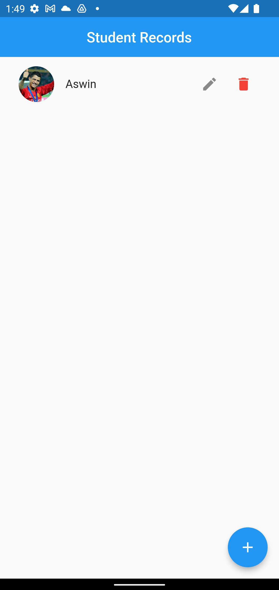
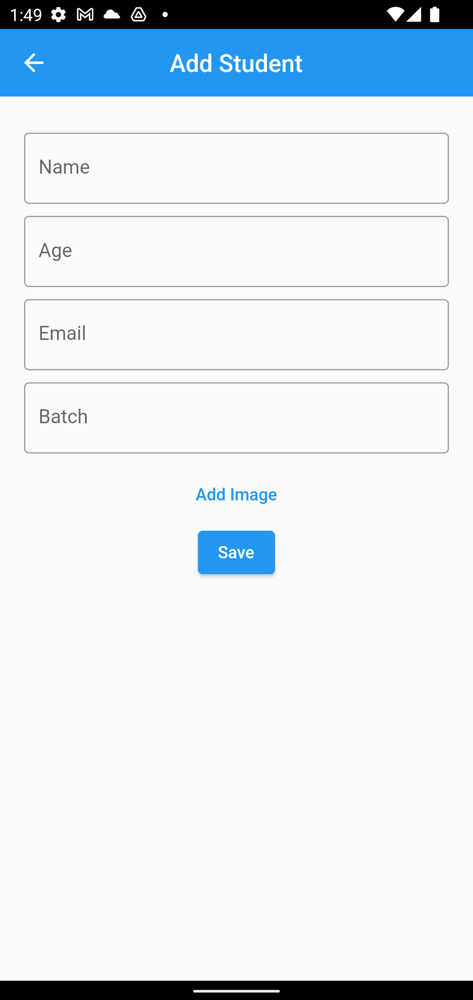
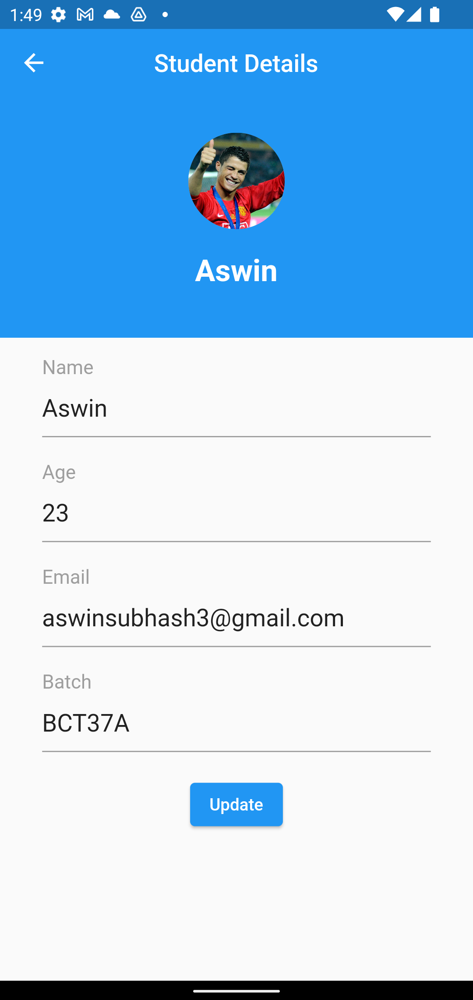

# STUDENT MANAGER

This application is used for managing the student details like
age, class, batch no, mobile number etc

## Libraries and packages used
- GetX
- Google fonts
- Hive
- Hive flutter
- Image picker
- Build runner
- Hive generator

 # STUDENT MANAGER

This application is used for managing the student details like
age, class, batch no, mobile number etc

## Table of contenst

- [Installation](#installation)
- [Screenshots](#screenshots)
- [Packages and Credits](#packages-and-credits)
- [License](#license)

## Installation

To install and run this project, you will need to have the following dependencies installed on
your machine:
 - Flutter SDK
 - Android Studio or Visual Studio Code

To install the project, follow these steps:

1. Clone the repository to your local machine
2. Open the project in Android Studio or Visual Studio Code
3. Connect an Android device or lauch an emulator
4. Run the command 'flutter pub get' using the terminal
5. Run the project by clicking the "run" button in the top menu or by using the terminal
   command 'flutter run'

## Screenshots 

Home Screen             |  Add Student Screen   |  Edit Screen Screen
:-------------------------:|:-------------------------:|:-------------------------:
||

## Packages and Credits

- [Getx](https://github.com/jonataslaw/getx)
- [Google fonts](https://github.com/material-foundation/google-fonts-flutter)
- [Hive](https://github.com/hivedb/hive/tree/master/hive)
- [Hive flutter](https://github.com/hivedb/hive/tree/master/hive_flutter)
- [Image picker](https://github.com/flutter/plugins/tree/main/packages/image_picker/image_picker)
- [Build runner](https://github.com/dart-lang/build/tree/master/build_runner)
- [Hive generator](https://github.com/hivedb/hive/tree/master/hive_generator)

## License

- MIT License
- Copyright 2022 © [ASWINSUBHASH](https://github.com/aswinsubhash)

